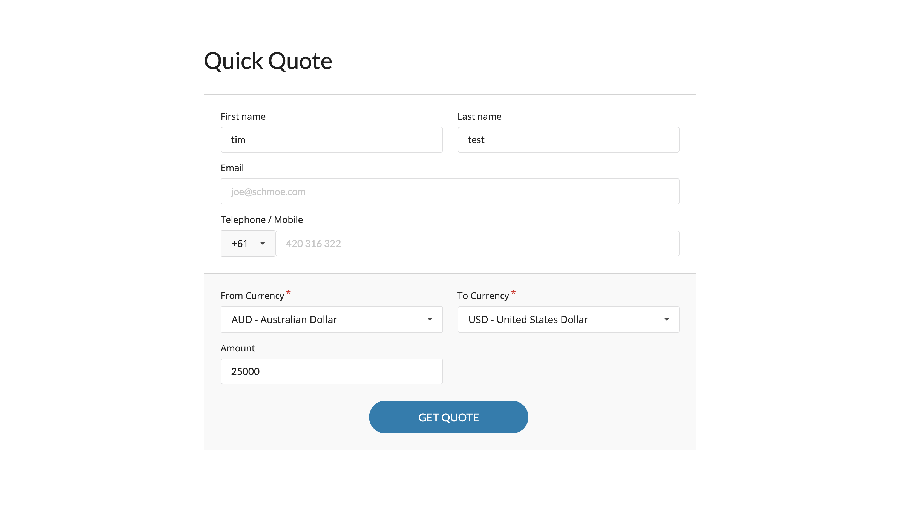

# Currency Converter

By [Tim Kelly](https://timkelly.dev/)

## Hosted Link

[timkellytk.github.io/currency-converter/](https://timkellytk.github.io/currency-converter/)

## Instructions

1. Navigate to [repo](https://github.com/timkellytk/currency-converter)
2. Clone locally using `https://github.com/timkellytk/currency-converter.git`
3. Install dependencies using `npm install`
4. Run tests using `npm test`
5. Start your server using `npm start`
6. Navigate to app in [browser](http://localhost:3000)
7. Enjoy!

## Technologies

- React
- React Router
- Semantic UI React
- Styled Components
- HTML
- CSS
- [create-react-app](https://goo.gl/26jfy4)
