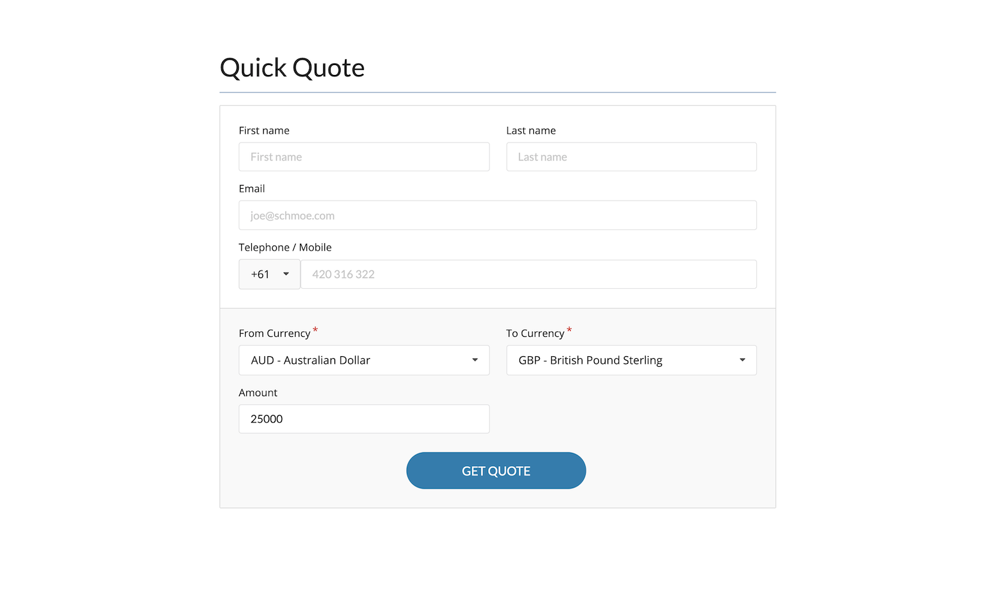

# Currency Converter

By [Tim Kelly](https://timkelly.dev/)

## Hosted Link

[timkellytk.github.io/currency-converter/](https://timkellytk.github.io/currency-converter/)

## Instructions

1. Navigate to [repo](https://github.com/timkellytk/currency-converter)
2. Clone locally using `https://github.com/timkellytk/currency-converter.git`
3. Install dependencies using `npm install`
4. Start your server using `npm start`
5. To run tests, start your server with `npm start` and run tests with `npm test`
6. Navigate to the app in the [browser](http://localhost:3000)
7. Enjoy!

## Technologies

- React
- React Router
- Semantic UI React
- Styled Components
- Cypress
- HTML
- CSS
- create-react-app

## Suggested Improvements

If provided more time, I would make the following improvements:

- Style the dropdown icon as shown in OFX's screenshots
- Create a mask for the `Amount` to separate the number on thousands (e.g. 25,000.00)
- Refactor state form logic using the [formik](https://formik.org/) library
- Get all the quote requests saved to a databas
